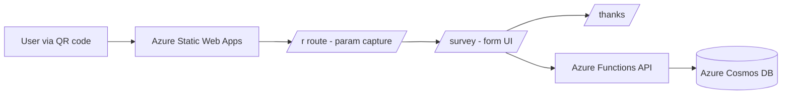

# Architecture

## System Diagram

## Component Responsibilities
- **Frontend (React + Vite):** Parses `bakeSessionID` and `submitterName`, fetches form definitions, renders questions, posts submissions, and shows a thank-you page.
- **Azure Functions:** Implements `/api/form` (read) and `/api/submit` (write) with input validation and basic anti-bot checks.
- **Cosmos DB:** Stores form definitions and submission documents.
- **Static Web Apps:** Hosts the SPA, provides `/api` integration, and rewrites routes to `index.html` for client-side routing.

## Data Flow
1) QR opens `/r?bakeSessionID=...&submitterName=...`.
2) `/r` stores parameters and navigates to `/survey`.
3) `/survey` requests `/api/form?bakeSessionID=...`.
4) User completes the form and submits to `/api/submit`.
5) Submission is stored in Cosmos DB, then `/thanks` is shown.
